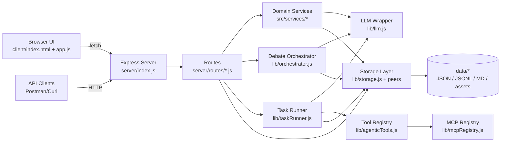

# Current Architecture Inventory

## Overview
This repository is a local-first Node.js workbench for persona-centric AI conversations (simple chat, persona chat, debate), knowledge packs, governance analytics, and agentic task execution. It is implemented as a single Express server that serves both API and static client assets, with file-based persistence under `data/`.

## Runtime Components
- App server: `server/index.js`
  - Express app, static client hosting (`client/`), auth middleware, and API route mounting.
- UI: `client/index.html`, `client/app.js`, `client/styles.css`
  - Single-page style UI with tabs/subtabs for chat, governance, and admin/config.
- API surface (local REST): `server/routes/*.js`
  - Personas, knowledge, debates, persona chats, simple chats, agentic tasks, admin, auth, support, topics, settings, images.
- Conversation/domain services: `src/services/*`, `src/domain/*`
  - Session creation, participant selection, orchestration policy, prompt construction, response shaping.
- LLM client wrapper: `lib/llm.js`
  - OpenAI + Azure OpenAI chat completions support, retry logic, image generation support.
- Debate engine: `lib/orchestrator.js`
  - Multi-round debate execution, moderator synthesis, transcript + message logging.
- Tool runner: `lib/agenticTools.js`
  - Registry-based tools (`web.fetch`, `http.request`, filesystem tools, image generation, autonomy tools, MCP tool bridge).
- Task runner: `lib/taskRunner.js`
  - Executes tool/LLM/job steps with dependency ordering + approvals, persists task and tool usage artifacts.
- File storage layer: `lib/storage.js`, `lib/agenticStorage.js`, `lib/auth.js`, `src/support/supportStorage.js`
  - Abstracts JSON/JSONL/markdown file reads and writes.

## Execution Boundaries
- HTTP request/response execution for most chat operations and CRUD APIs.
- Debate run execution is queued in-process (`runQueue` promise chain in `server/routes/debates.js`) and executed sequentially by `runConversationSession -> runDebate`.
- Agentic tasks execute via API-triggered runner logic; approvals are persisted and re-entered via endpoints.

## High-Level Data Flow
1. User interacts with browser UI (`client/app.js`) or API client.
2. Express route validates payload (Zod schemas from `lib/validators.js`), resolves entities from file storage.
3. Service/orchestrator builds prompts and calls `chatCompletion` in `lib/llm.js`.
4. Results are persisted as session JSON + transcript/message logs in `data/`.
5. Governance/admin endpoints aggregate persisted artifacts into analytics views.

## Mermaid Diagram

